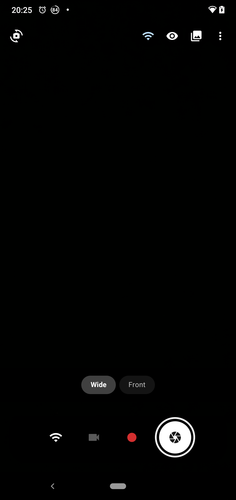
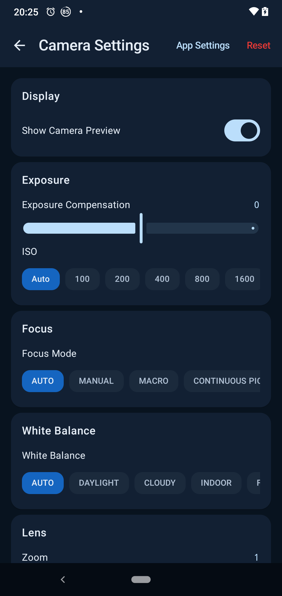
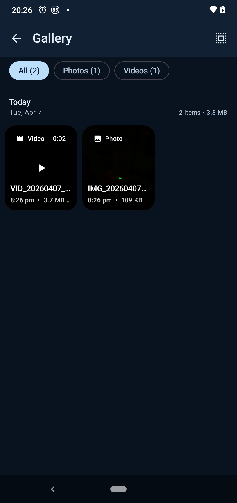
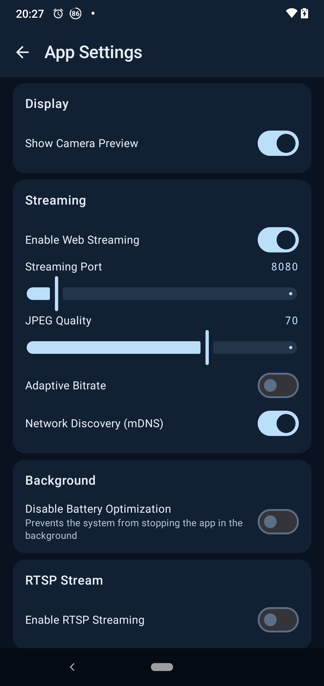
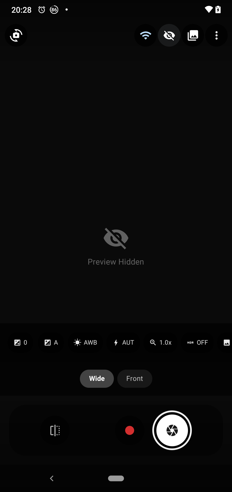

<div align="center">


</div>

<div align="center">

# LensCast

</div>

<p align="center">
  
  
  
  
  
</p>

</br>

<p align="middle">
    
    
    
    
    
</p>

<div align="center">

# Project Overview

LensCast is an Android camera application with live video/audio streaming to web browsers over WiFi. It turns your Android device into a networked camera station with professional controls, remote web access, interval photography, and scheduled recording.

</div>

---

## Features

### Camera
- Live preview with professional quick settings bar
- Manual controls: exposure compensation, ISO, white balance, focus mode, zoom
- Multi-lens support (ultra-wide, wide, telephoto) with runtime lens switching
- HDR, image stabilization, resolution (up to 4K), and frame rate controls (15–60 fps)
- Photo capture and video recording
- Night vision / IR mode (Off, Auto, On) for low-light environments
- Scene modes (Face Detection, Night, HDR, Sunset, Fireworks, Action, Portrait, and more)
- Focus distance control for manual focus mode
- Color temperature adjustment (2000K–9000K) for manual white balance
- Viewfinder aids: composition grid lines (3×3 / 4×4 / golden ratio), a two-axis spirit level (green when near-level), a self-timer (3 s / 10 s, tap-to-cancel), and pro tools computed from the live analysis stream — luma histogram, over/under-exposure zebras, and focus peaking
- Photo capture quality: JPEG quality setting (60–100) with a maximize-quality capture mode, RAW+JPEG (DNG) capture on cameras that support it (per-shot toggle, fail-closed on capability check), and opt-in EXIF tagging — GPS geotag (runtime location permission requested only when the setting is first enabled) plus artist/comment metadata
- Localized UI: the app screens ship in English, German, and Spanish

### Live Streaming
- HTTPS mode with a self-signed on-device certificate (fingerprint shown for one-tap verification) — encrypts streams and enables in-browser microphone talkback
- Low-latency H.264 playback in the dashboard via WebCodecs over WebSocket, with an automatic fallback ladder to MJPEG and then HLS (muxed A/V for iOS) — both fallback rungs are plain HTTP(S) requests (no WebSocket), so playback keeps working when WebSockets are blocked
- Real-time M-JPEG video streaming to any web browser on the same WiFi network
- RTSP streaming with AAC audio and H.264 or H.265 video (H.264 is the default; the HLS and WebCodecs playback paths stay H.264-only) at 480p/720p/1080p, for use with VLC, OBS, NVRs, and other RTSP clients
- Mid-GOP RTSP joins: every PLAY re-arms a per-client keyframe wait and requests a sync frame, so a client that connects late starts decoding at the next IDR frame instead of choking on orphaned P-frames
- RTMP push publishing (off by default): pushes the same H.264/AAC encode to an RTMP or RTMP(S) server — YouTube, Twitch, nginx-rtmp, or any media server — configured with a `rtmp://[user:pass@]host[:port]/app/stream-key` URL, with a capped-backoff auto-reconnect while enabled, a status line (idle/connecting/connected/error) on the device status snapshot, `/api/stream/rtmp/start|stop` routes, and a clean FCUnpublish/DeleteStream close; H.264 only (H.265 has no standard RTMP mapping and the push refuses to start under it), see [RTMP push](docs/rtmp.md)
- WHIP push publishing (WebRTC, RFC 9725; off by default): pushes camera video over WebRTC to any WHIP ingest — MediaMTX, Cloudflare (SFU) mode, IVS, LiveKit — via an `http(s)://[user:pass@]host[:port]/endpoint` URL plus an optional bearer token and STUN server (blank STUN = LAN-only host candidates); video encodes from the camera NV21 tap with libwebrtc's hardware H.264 (independent of the RTSP codec setting), audio rides a dedicated 16 kHz mono Opus capture only while the microphone is free (video-only otherwise), ICE is one-shot with a ~3 s gather cap, teardown DELETEs the session resource, and the status line mirrors on the device snapshot with `/api/stream/whip/start|stop` routes
- ONVIF Profile S device service (off by default): WS-Discovery answers probes on UDP 239.255.255.250:3702 and a SOAP endpoint at `/onvif/device_service` serves the standard device/media queries, so ONVIF NVRs such as Home Assistant can discover the camera automatically — unauthenticated by design (LAN device metadata and stream URIs only; RTSP keeps its own auth), see [NVR integration](docs/nvr-integration.md)
- Live audio streaming with configurable bitrate (32–320 kbps), channels (mono/stereo), and echo cancellation
- Adaptive bitrate control that dynamically adjusts JPEG quality and frame rate based on network quality and thermal state
- Stream overlays with configurable timestamp, branding text, custom text, and viewer count display
- Privacy masking zones with blackout, pixelate, or blur effects on user-defined regions
- Optional HTTP Basic Authentication for secure access (web and RTSP)
- mDNS / NSD service discovery so clients can find the stream on the local network automatically
- Network quality monitoring with per-client throughput tracking and quality level classification (Excellent → Critical)
- Foreground service with persistent notification to keep streaming alive in the background
- Resume streams on boot (when the setting is enabled) and a Quick Settings tile for unattended camera operation — the tile is a manual request and always starts, restoring the outputs the on-device journal last recorded
- Optional API token (Bearer / X-Api-Token header) for programmatic clients like Home Assistant or curl: read-only GET/HEAD on the protected routes plus POST on an explicit allow-list (stream/web/RTSP/RTMP start and stop, photo capture, recording start and stop, siren, torch, the ML-model and audio-model downloads, and the detection-test alert) — auth and session-management routes are never token-writable

### Web UI (Remote Control Dashboard)
- Full remote camera control dashboard built with SolidJS, Tailwind CSS v4, and DaisyUI
- Live stream preview with start/stop/resume controls for both web (M-JPEG) and RTSP streams
- Remote camera settings: exposure, focus, white balance, zoom, resolution, frame rate, HDR, stabilization, night vision, and scene mode
- Streaming settings: port, JPEG quality, adaptive bitrate toggle, web/RTSP enable/disable, audio configuration
- Stream overlay configuration: timestamp, branding, custom text, position, font size, colors
- Privacy masking editor: create, position, resize, and configure masking zones (blackout/pixelate/blur)
- Interval capture controls: interval, total captures, quality, capture mode, flash mode
- Video recording controls with scheduled recording via time picker, quality presets, duration limits, and repeat intervals
- Connected-clients panel with true socket kick, per-session stats, and remote credential rotation + session revocation
- Connection quality indicator with real-time bandwidth, throughput, latency, and per-client stats
- Connection-lost banner: shows once the status poll has failed several times in a row with the live event stream down, and clears on the next success or stream reopen
- Remote media gallery with thumbnail grid, day-grouped sections with a date jump, full-resolution photo viewer, and file downloads
- Recording timeline: an NVR-style day timeline of recording sessions fed by `GET /api/recordings/sessions?day=YYYY-MM-DD`, with motion/sound triggers marked and each session linking to its clip in the gallery
- Detection statistics card: windowed counts (24 h / 7 d / all-time), a seven-day per-day bar chart, and the most-fired zones and ML labels, rendered from `GET /api/detection/stats`
- Multi-camera panel: watch several LensCast phones side by side — manually added camera URLs persist in the browser and render as snapshot or live M-JPEG tiles (per-tile and one-tap "live all" toggles, with automatic snapshot fallback on stream errors)
- Installable PWA (web app manifest with theme colors and icons) and a light/dark theme toggle that follows the OS preference by default
- Storage forecast: a days-until-quota estimate computed from capture history growth against the configured storage quota, shown only when enough history exists
- HTTP Basic Authentication login screen
- Cinematic dark-themed glassmorphism design with micro-animations

### Detection & Alerts
- Motion detection with configurable sensitivity, detection zones, an arm schedule (time-of-day window, midnight-wrapping, plus a day-of-week mask — clear days to disarm them), and a per-event cooldown in seconds
- Per-zone motion attribution: each event, webhook, and MQTT alert carries the labels of the zones that fired
- Motion-triggered bounded recording with post-roll, or the legacy auto-photo mode
- Object detection (ML): an on-device EfficientDet-Lite0 model (LiteRT task library, ~4.4 MB int8 model — not bundled in the APK; downloaded once on first use from the TensorFlow Hub source and SHA-256-verified into app storage) can gate motion events — when enabled, the triggering frame is classified and the event is suppressed unless a person, a common pet/livestock animal, or a road vehicle is detected at or above the confidence threshold, with per-group toggles to narrow the gate to people, animals, and/or vehicles (fail-open: a throttled or failed classification never suppresses an alert); detected labels ride the webhook/MQTT payloads, the event log, and the dashboard feed
- Continuous recording: an NVR-style loop of chained segments (5–60 minutes) riding the existing bounded-recording machinery; segments land in the gallery like any recording and age out via the capture retention window, a manual stop pauses the loop for 60 s, and motion-triggered clips are skipped while the loop is live (the events still fire and log, without a clip link)
- Sound detection with an RMS threshold and its own per-event cooldown, plus an optional adaptive noise floor: the trigger rides above a slow moving average of the ambient level, so constant background noise (HVAC, traffic) neither masks real events nor trips the detector on its own — and an optional Record on Sound toggle starts a bounded clip (riding the motion post-roll duration) on each sound event
- Sound classification (YAMNet, opt-in): an on-device audio classifier (MediaPipe tasks-audio, ~3.9 MB model — not bundled in the APK; downloaded once on first use from the TensorFlow Hub source and SHA-256-verified into app storage) labels the audio around each sound event (smoke alarm, siren, dog bark, breaking glass, gunshot, speech…) and the class labels ride the webhook/MQTT payloads, the event log, and the dashboard feed like the ML object labels do — annotate-only by design (classification never suppresses or delays the RMS event; a missing model, an API-24- device, or a failed window just ships the event unlabeled), with a confidence threshold and a user-narrowable allow-list of security-relevant classes, plus label-stability and cooldown logic so a chirping smoke alarm retriggers sanely; requires Android 7.0+ (API 24), like the ML object gate
- Tamper detection: a power cut while streaming (a charging camera losing power) raises a tamper event — opt-in via the Tamper Detection toggle in Detection settings (off by default); the tamper response also preserves evidence — the detection-event log is flushed to disk immediately and, when backup is armed, every pending un-uploaded capture's backup is re-queued as an expedited WorkManager request that skips Wi-Fi-only mode (the camera may never see power — or Wi-Fi — again)
- Local heads-up alerts per detection event with the trigger snapshot as the big picture (opt-out, runtime notification permission requested on first launch), with optional quiet hours — notifications are held inside a scheduled window (webhooks, MQTT, recordings, and the event log keep firing)
- Webhook alerts (ntfy/Home Assistant/any JSON endpoint) with the trigger snapshot, triggered zone and ML class labels, and battery level embedded in the JSON payload, custom headers, and automatic retries
- MQTT alert publishing to any broker with Home Assistant discovery: motion/sound/tamper appear as `binary_sensor` entities automatically, with retained availability and a last will (offline on ungraceful loss) — see [NVR integration](docs/nvr-integration.md)
- Web Push notifications to subscribed browser dashboards: the phone encrypts each detection event per RFC 8291 (aes128gcm, ephemeral ECDH + HKDF-SHA256) and publishes it — authenticated per RFC 8292 (VAPID, ES256, key generated once on-device) — straight to the browser's push service (FCM/Mozilla autopush; no account), where the dashboard's service worker shows the notification even with the tab closed, with a notification tap focusing the dashboard; the dashboard's Web Push card subscribes the browser and carries the `pushEnabled` master toggle (detection settings on the phone carry it too), and 404/410 answers prune expired subscriptions automatically — requires the HTTPS dashboard mode (a self-signed certificate is fine, accepted once): browsers only allow push from a secure context, so plain `http://` LAN addresses hide the feature gracefully
- On-device detection event log with a live dashboard event feed (thumbnail, type, dispatched actions, zone/ML labels, and a link to the event's recorded clip) — pushed over server-sent events with an automatic polling fallback, filterable by type in the API (`?type=`), and downloadable as CSV or JSON (`GET /api/detection/events/export?format=csv|json&type=`); CSV cells that begin with a formula trigger (`=`, `+`, `-`, `@`, tab) carry an apostrophe guard so spreadsheet apps never execute exported labels; the phone app gains its own Detection Events screen (tap a detection alert to open it)
- Detection statistics at `GET /api/detection/stats`: per-type counts over 24 h / 7 d / all-time windows, a seven-day per-day series, and the most-fired zones and ML labels
- Recording-session timeline at `GET /api/recordings/sessions?day=YYYY-MM-DD`: the requested local day's video captures as NVR sessions with an inferred end (known duration, else the next capture's gap, else a 60 s bar) and a reconstructed trigger — `motion`/`sound` when a detection event overlaps the capture window, `manual` otherwise (continuous/scheduled origins are not recoverable historically); a missing or invalid day answers today
- Read-only diagnostics at `GET /api/system`: app version, device model, Android version, OS and process uptimes, battery detail (temperature, voltage, health), and storage usage against the configured quota
- Automatic deterrence: optional siren and torch auto-trigger on detection, with a configurable cooldown — the siren auto-stops after its duration, while the torch stays on until turned off

### Automation
- Broadcast intents for automation apps, adb, and scripts: start/stop streaming, capture a photo, start/stop recording, set torch, set siren — `com.raulshma.lenscast.action.*`, see `automation/AutomationReceiver.kt`. Optional extras: `enabled` (boolean) makes SET_TORCH/SET_SIREN set an explicit on/off state instead of toggling, and `durationSeconds` (integer) bounds a START_RECORDING clip (0–3600) or auto-stops a SET_SIREN start (a new duration command re-arms the timer, extending a running siren)
- The receiver is exported but permission-guarded: a sending app must declare `<uses-permission android:name="com.raulshma.lenscast.permission.AUTOMATION" />` — a `dangerous`-level permission, so a helper app must also request it at runtime (like camera access); it is not granted automatically at install. Senders that cannot hold permissions — Tasker/MacroDroid intent actions — can still reach it over adb (`adb shell am broadcast`, which sends as the exempt shell uid) or from a tiny helper app that declares and runtime-requests the permission
- Home-screen widget with one-tap stream start/stop and photo capture, kept honest across tile and web toggles

### Backup
- Auto-upload new captures to any WebDAV collection (Nextcloud/self-hosted) or Telegram chat (Bot API), with Wi-Fi-only mode and WorkManager-backed retries
- OS-level cloud backup / device transfer never carries the auth session tokens (`auth/sessions.json`) or the detection-event log (`detection_events.json` — its entries embed base64 camera snapshots); both are excluded via `backup_rules.xml` / `data_extraction_rules.xml` and stay device-only

### Self-Update
- In-app update check against GitHub releases with a SHA-256 digest + APK size integrity gate before install — verification is skipped (the update proceeds unverified) when a release omits the digest

### Capture
- One-tap quick photo and video capture
- Interval/time-lapse photography with configurable interval (1–3600s), total captures, JPEG quality, capture mode, and flash mode
- Scheduled video recording with quality presets (High/Medium/Low), duration limits, repeat intervals, and optional audio
- Capture history tracking persisted via DataStore
- Time-based retention: optional capture and detection-event windows in days (0 = keep forever, else the oldest entries beyond the window are deleted) swept on startup, on every media refresh, and after every append
- Storage quota: a configurable cap in MB (100 MB–32 GB, default 2 GB) on LensCast's media — the oldest captures are deleted automatically once the quota is exceeded, alongside a low-disk safety floor
- Media encryption at rest (opt-in, off by default): new photos and videos are encrypted per file with AES-256-GCM under a single hardware-backed Android Keystore key (random nonce per file, `LCE1` magic header, real `.jpg`/`.mp4` names kept). Migration-free by design — flipping the toggle never re-encrypts or decrypts existing media, because every reader sniffs the per-file header, so plaintext and encrypted captures coexist and decrypt transparently in the app gallery, the web dashboard, and `/api/media`. Documented trade-offs: while enabled, video thumbnails show a placeholder (the thumbnail decoder needs real mp4 bytes at rest — playback still works through the decrypting stream, in-app and over the web API), photos are served from a decrypted cache file for Coil, and backups upload the *decrypted* capture so the remote copy is readable evidence
- Video recording as a foreground service for reliability

### Gallery
- Grid layout with chronological sections
- Filter by media type (All, Photos, Videos)
- Selection mode for batch operations
- Full-screen media viewer with horizontal pager navigation and shared element transitions
- Video thumbnail extraction via Coil video decoder
- Share and delete capabilities
- Also accessible remotely from the Web UI with thumbnail grid and download support

### Monitoring & Power Management
- Device thermal state monitoring (Normal → Critical) with automatic quality and frame rate adaptation
- Battery level monitoring with tiered optimization: auto-reduces quality, bitrate, and resolution as battery drops
- Eco idle-fps mode (opt-in, `ecoIdleFpsEnabled`): while on battery, thermal is normal, and no stream consumer is connected, the frame rate drops to a low idle floor and live-audio encoding pauses — the first viewer, charger, or thermal event restores the full rate (with a cooldown so flapping clients can't thrash)
- Charge diagnostics for 24/7 devices: `GET /api/system` battery detail also carries the charge counter (mAh), the signed instant current (µA), and — on Android 14+ — the charge-cycle count, when the hardware reports them
- Power save mode detection and Doze mode awareness
- Wake lock management for long-duration streaming and recording sessions
- Battery optimization exemption request for uninterrupted background operation

### Networking
- Network change monitoring with real-time connectivity state tracking (WiFi, Cellular, Ethernet, Bluetooth, VPN)
- Automatic stream URL generation based on device local IP
- Per-client connection statistics with throughput, latency, and frames-per-second tracking
- HTTP Range request support for video file streaming in the web gallery

---

## Documentation

- [Remote access](docs/remote-access.md) — viewing the stream outside your LAN (Tailscale, WireGuard, and why port forwarding is discouraged)
- [NVR integration](docs/nvr-integration.md) — Home Assistant (generic camera + ONVIF), VLC/ffmpeg, Frigate, and detection webhook recipes
- [RTMP push](docs/rtmp.md) — push-publishing the stream to YouTube, Twitch, nginx-rtmp, and other RTMP(S) servers
- [Wear companion](wear/README.md) — the Wear OS module: watch-side stream toggle, photo capture, and snapshot view over the LAN API

---

## Tech Stack

**Android**
- Kotlin, Jetpack Compose, Material 3
- CameraX (camera2 backend), WorkManager, DataStore Preferences, NanoHTTPD
- MVVM architecture with Kotlin Coroutines and StateFlow
- Moshi for JSON serialization, Coil for image/video loading
- Custom RTSP server with H.264/H.265/AAC RTP packetization, plus a hand-rolled RTMP push publisher
- LiteRT (TensorFlow Lite task-vision) for on-device object detection; MediaPipe tasks-audio for YAMNet sound classification
- Wear OS companion module (:wear, Compose for Wear OS) talking to the same LAN HTTP API

**Web UI**
- SolidJS, Tailwind CSS v4, DaisyUI v5, Vite, TypeScript
- Built output embedded directly into Android assets at build time

---

## Requirements

- Android 6.0 (API 23) or later (ML object detection requires Android 7.0 / API 24+)
- WiFi connection for streaming
- Camera and microphone permissions
- Node.js 20+ and npm (for building the web UI)
- JDK 17 (for building the Android app)

---

## Building

<details>
<summary><strong>Prerequisites</strong></summary>

  - Android Studio or Gradle CLI
  - JDK 17
  - Node.js 20+ with npm
</details>

### Build Commands

```bash
# Build the web UI and Android app together (Gradle builds the web UI automatically)
./gradlew assembleDebug

# Or build them separately:

# 1. Build the web UI (outputs to app/src/main/assets/webui/)
cd web && npm install && npm run build

# 2. Build the Android APK
./gradlew assembleDebug

# F-Droid flavor (no self-updater, no REQUEST_INSTALL_PACKAGES)
./gradlew assembleFdroidDebug

# Build a signed release APK (requires keystore environment variables)
# KEYSTORE_PASSWORD, KEY_ALIAS, KEY_PASSWORD must be set
./gradlew assembleRelease
```

### Web UI Development

```bash
cd web
npm install
npm run dev    # Starts dev server on port 3000 with proxy to Android device
```

The Vite dev server proxies `/api`, `/stream`, `/audio`, and `/snapshot` requests to `localhost:8080` for local development against a running LensCast instance.

---

## CI/CD

A CI workflow (`.github/workflows/ci.yml`) runs on every push to main and every pull request: web UI typecheck + vitest, JVM unit tests for both flavors, and a store-flavor debug build.

A GitHub Actions workflow (`.github/workflows/release.yml`) automates release builds:
- Triggers on pushes to `v*` or `release/**` branches, or via manual dispatch
- Builds the **store flavor** (with the in-app updater) as one signed APK per ABI (`armeabi-v7a`, `arm64-v8a`, `x86_64`) with distinct `versionCode`s (`major*10000 + minor*1000 + patch*10 + abiIndex`); the `fdroid` flavor is built by F-Droid's own recipe, not shipped here
- Publishes them to a **draft** GitHub Release with automatic semantic version tagging — verify the assets, then publish
- The `versionCode`/`versionName` literals in `app/build.gradle.kts` (which F-Droid's update checker reads) must be bumped in the same release — the workflow overrides them per build via `-PversionCode`/`-PversionName` but does not rewrite the tag's literals

---

## Permissions

| Permission | Purpose |
|---|---|
| `CAMERA` | Camera preview and capture |
| `RECORD_AUDIO` | Live audio streaming and video recording with audio |
| `INTERNET` | Serving the HTTP/RTSP streams |
| `ACCESS_NETWORK_STATE` / `ACCESS_WIFI_STATE` | Detecting network connectivity and IP address |
| `CHANGE_WIFI_MULTICAST_STATE` | mDNS service discovery |
| `FOREGROUND_SERVICE` / `FOREGROUND_SERVICE_CAMERA` / `FOREGROUND_SERVICE_MICROPHONE` | Background streaming and recording |
| `WAKE_LOCK` | Keeping the device awake during long sessions |
| `REQUEST_IGNORE_BATTERY_OPTIMIZATIONS` | Requesting Doze mode exemption |
| `READ_MEDIA_IMAGES` / `READ_MEDIA_VIDEO` | Accessing captured media in gallery |
| `POST_NOTIFICATIONS` | Foreground service notifications and local detection alerts |
| `ACCESS_COARSE_LOCATION` | Optional EXIF GPS geotagging of photos (runtime-requested only when the setting is first enabled) |

---

## Project Structure

```
app/src/main/java/com/raulshma/lenscast/
├── camera/          Camera preview, controls, CameraX integration, and lens management
│   └── model/       Camera settings, state, overlay/pro-tools/self-timer policies, and lens info models
├── capture/         Photo/video capture, interval scheduling, recording service
│   ├── ml/          On-device ML object detection (LiteRT) and YAMNet sound classification
│   └── model/       Capture history and recording/detection policy models
├── gallery/         Media gallery grid, viewer with pager, and media management
├── streaming/       HTTP server, MJPEG/audio/RTSP streaming, web API controller
│   ├── model/       Web API DTOs
│   ├── onvif/       ONVIF Profile S device service and WS-Discovery responder
│   ├── rtmp/        RTMP push publisher (AMF0, chunk protocol, FLV media tags)
│   └── rtsp/        RTSP server, H.264/H.265 encoders, AAC encoder, RTP packetizers
├── settings/        Camera settings and app settings screens with ViewModels
├── navigation/      Compose navigation graph with shared element transitions
├── core/            Power management, thermal monitoring, network monitoring, media crypto
├── data/            DataStore settings persistence, capture history store
└── ui/              Theme, shared components, and animation utilities

wear/                Wear OS companion module (watch-side remote control)
web/                 SolidJS web UI for remote control
├── src/
│   ├── components/  Dashboard components (stream, settings, overlay, gallery, etc.)
│   ├── lib/         Pure dashboard logic (timeline math, stats mapping, forecasts)
│   ├── api/         HTTP API client
│   ├── hooks/       Application state management and utilities
│   └── types.ts     TypeScript type definitions and constants
└── vite.config.ts   Build config (outputs to Android assets)
```

---

## Star History

<a href="https://www.star-history.com/#raulshma/lenscast&type=timeline&legend=top-left">
 <picture>
   <source media="(prefers-color-scheme: dark)" srcset="https://api.star-history.com/svg?repos=raulshma/lenscast&type=timeline&theme=dark&legend=top-left" />
   <source media="(prefers-color-scheme: light)" srcset="https://api.star-history.com/svg?repos=raulshma/lenscast&type=timeline&legend=top-left" />
   
 </picture>
</a>

---

## License

This project is licensed under the GNU General Public License v3.0 — see the [LICENSE](LICENSE) file for details.
